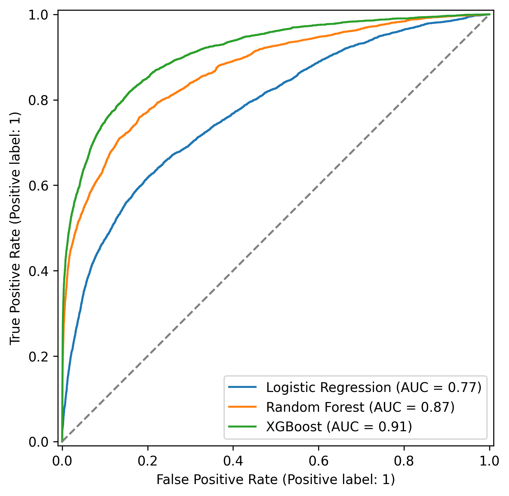
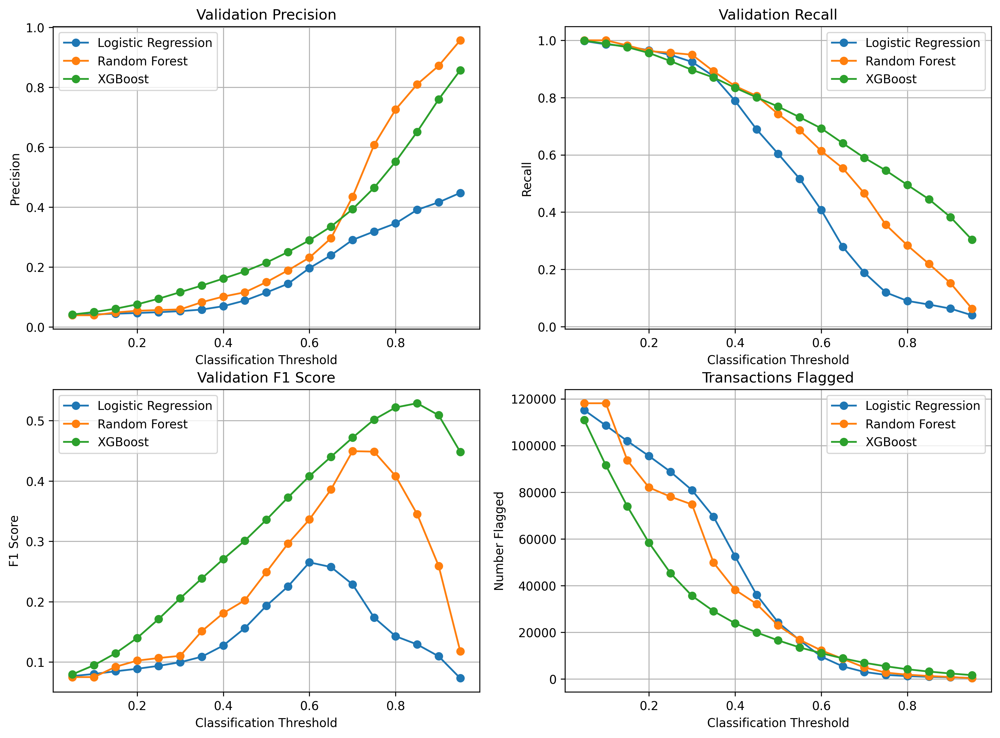
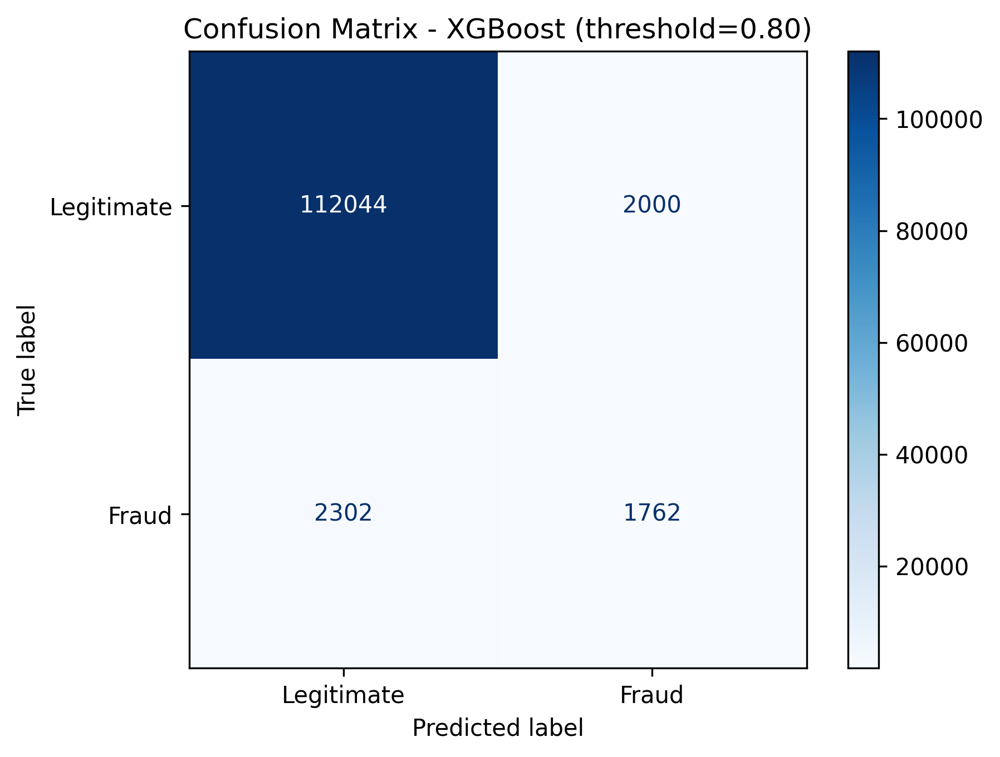

# Fraud Detection Model Comparison

## 1. Problem Statement

Fraud detection is a critical challenge for industries such as e-commerce and banking, where fraudulent transactions can result in significant financial losses. This project applies machine-learning techniques to detect fraudulent transactions using the IEEE-CIS fraud detection dataset provided by Vesta Corporation. It compares Logistic Regression, Random Forest, and XGBoost to determine which model most effectively distinguishes fraudulent transactions from legitimate ones.

## 2. Data Preparation

### Removing incomplete variables

The percentage of missing values is calculated for every column. Variables with at least 50% missing values are removed. This reduces the influence of fields that contain too little information.
### Handling missing values

The remaining variables are separated into categorical and continuous features:

- Missing categorical values are replaced with `Missing`.
- Missing continuous values are replaced with the median of each column.

### Encoding categorical variables

Categorical variables are converted into numeric indicator columns using one-hot encoding. The training data defines the final set of feature columns. Validation and test data are reindexed to those same columns, with unavailable columns filled with zero.

## 3. Experimental Design

### Chronological splitting

After cleaning, the data is sorted by `TransactionDT` and split sequentially:

- 60% for training
- 20% for validation
- 20% for testing

The training period is used to fit the models. The validation period is used to compare thresholds. The final test period is kept separate for measuring performance on later transactions.

### Addressing class imbalance

The fraud class is less frequent than the legitimate class. To reduce the risk that models ignore fraud, the notebook applies class weighting:

- Logistic Regression assigns greater weight to fraudulent examples.
- Random Forest uses balanced class weights.
- XGBoost uses a `scale_pos_weight` calculated from the training labels.

## 4. Models

### Model Selection

Three machine-learning models were evaluated: Logistic Regression, Random Forest, and XGBoost. Model performance was assessed using ROC-AUC, average precision, precision, recall, and F1 score.

The ROC curve below is generated using validation data. It compares each model's ability to rank fraudulent transactions above legitimate transactions across classification thresholds.

The ROC curve shows the relationship between the true-positive rate and false-positive rate across classification thresholds. Curves that remain farther above the random-classifier diagonal and closer to the top-left corner indicate better ranking performance.

## 5. Threshold Selection

### Evaluation Procedure

Each model produces a probability rather than a final fraud label. The notebook evaluates thresholds from 0.05 to 0.95 in increments of 0.05.

For each threshold, it calculates:

- Precision
- Recall
- F1 score
- Number of transactions flagged as fraud

The evaluation plot compares precision, recall, F1 score, and the number of flagged transactions across thresholds. This makes the trade-off between detection performance and review workload visible for each model.

The threshold with the highest validation F1 score is selected separately for each model. That threshold is then used when evaluating the model on the test set.

This procedure recognizes that a 0.50 threshold is not automatically appropriate for an imbalanced fraud problem. A lower threshold may detect more fraud but generate more false positives, while a higher threshold may improve precision but miss more fraudulent transactions.

A confusion matrix is also created for the model with the highest validation F1 score. It shows true negatives, false positives, false negatives, and true positives.

## 6. Results

The executed notebook contains 590,540 transactions in total. The chronological split produced the following summary:

| Split | Transactions | Fraud rate | Fraud count |
|---|---:|---:|---:|
| Training | 354,324 | 3.38% | 11,988 |
| Validation | 118,108 | 3.90% | 4,611 |
| Test | 118,108 | 3.44% | 4,064 |

After one-hot encoding, each split contained 309 features.

### Validation results

The best threshold for each model was selected by validation F1 score:

| Model | Threshold | Precision | Recall | F1 score | Transactions flagged |
|---|---:|---:|---:|---:|---:|
| XGBoost | 0.85 | 65.14% | 44.50% | 0.529 | 3,150 |
| Random Forest | 0.70 | 43.44% | 46.56% | 0.449 | 4,943 |
| Logistic Regression | 0.60 | 19.65% | 40.75% | 0.265 | 9,561 |

XGBoost achieved the strongest validation F1 score of 0.529 and was selected as the best validation model.

### Final test results

Using the XGBoost threshold selected on validation data, the final test performance was:

| Metric | Test result |
|---|---:|
| Threshold | 0.85 |
| ROC-AUC | 0.882 |
| Average precision | 0.446 |
| Precision | 56.32% |
| Recall | 38.24% |
| F1 score | 0.456 |
| Transactions flagged | 2,759 |

### Confusion matrix

|  | Predicted legitimate | Predicted fraud |
|---|---:|---:|
| Actual legitimate | 112,839 | 1,205 |
| Actual fraud | 2,510 | 1,554 |

The test results show strong ranking performance, with ROC-AUC of 0.882. However, the selected high-precision threshold detected 1,554 of 4,064 fraudulent transactions and missed 2,510. A lower threshold could improve recall if detecting more fraud is more important than limiting false positives.

The test average precision of 0.446 is substantially higher than the test fraud prevalence of 3.44%. This indicates that XGBoost ranks fraudulent transactions considerably better than a random classifier, although the selected threshold still leaves many fraudulent transactions undetected.

## 7. Limitations

This project is a strong baseline but is not yet a production fraud-detection system.

1. A single chronological split does not show how stable performance is across different time periods.
2. F1-based threshold selection treats precision and recall as equally important, which may not reflect real business costs.
3. One-hot encoding high-cardinality fields can create a large and sparse feature matrix.
4. Some transaction, identity, or timing fields may be unstable over time or require additional leakage checks.
5. Historical IEEE-CIS data may not represent current fraud patterns.

## 9. Conclusion

This project establishes a practical baseline for fraud detection using the IEEE-CIS dataset. It combines missing-data treatment, categorical encoding, class-imbalance adjustments, chronological evaluation, and model-specific threshold selection. In the executed comparison, XGBoost performed best on validation data with an F1 score of 0.529 at a threshold of 0.85. On the untouched test period, it achieved ROC-AUC of 0.882, average precision of 0.446, precision of 56.32%, recall of 38.24%, and F1 score of 0.456.
